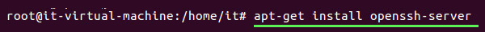
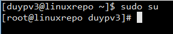
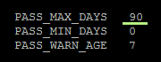

# Chính sách Security cho máy Linux 
---

## I. Mô tả chính sách

- [ ] Đồng bộ thời gian. [[#1. Đồng bộ thời gian với máy chủ domain FDN]]
- [ ] Tắt Firewall local trên máy cá nhân. [[#2. Tắt Firewall cá nhân]]
- [ ] Cấu hình Repository local & Chính sách SSH [[#4. Cấu hình Repository local & Proxy Linux]] [[#3. Config ssh (change port, access permission)]]
 - ==Không được sử dụng account root cho việc remote==
 - Port ssh sẽ là 2345
- [ ] Install McAfee-Agent,AV,DLP (With Evidence) [[#5. Install McAfee-Agent,AV,DLP (With Evidence)]]
- [ ] Install Nac (With Evidence) [[#6. NAC Forescout]]
- [ ] Install Ivanti (With Evidence) [[#7. Install Ivanti]]
- [ ] Join domain [[#8. Join Domain]]
	- [ ] Change Computer Name
	- [ ] Rename administrator account & set password / Add Root account & Set password
	- [ ] Add account Fsoft to Administrator group
	- [ ] Add account Local
		 - Tạo tài khoản Quản trị của NAC
		 - Đổi mật khẩu root
		 - Thêm account user (==User phải đổi pass sau khi login==).
- [ ] Install Fsoft Default Software
- [ ] Install WSUS (With Evidence)
- [ ] Chính sách account: 
 - Mật khẩu phức tạp
 - Đổi pass định kì 3 tháng/lần
- [ ] Add information Client to Manage Asset ITC (With Evidence)
---

## II. Hướng dẫn thực hiện

### 1. Đồng bộ thời gian với máy chủ domain FDN

- Bước 1: Cài đặt ntpdate Tool

```
apt-get install ntpdate
```

- Bước 2: Thực hiện update ngày từ AD:
```
ntpdate 10.133.79.90 
//hoặc dùng
ntpdate 10.133.79.7

timedatectl set-timezone Asia/Ho_Chi_Minh
```


### 2. Tắt Firewall cá nhân

- Tắt Firewall, gõ lệnh: 
```
service ufw stop

//Cập nhật các gói Update
apt update -y
```

### 3. Config ssh (change port, access permission) 
- **Kết nối SSH vào máy Linux sau khi cài đặt xong.**
	- *Bước 1*: Cập nhật database cho apt-get

	```
	apt-get update
	```
	
	- *Bước 2*: Cài SSH cho Ubuntu

	```
	apt-get install openssh-server
	
	//Redhat
	yum install openssh-server
	```

	
	
	- *Bước 3*: Cấp quyền để chạy
		 - ==Chú ý== nếu trước dấu nháy là dấu $. Thì ta đang mở mode user, chưa có quyền admin (root) nên khi gõ lệnh sẽ bị hạn chế. Ta sẽ phải chuyển về quyền Root, bằng lệnh "sudo su". Và nhập password của account duypv3 (**Account lúc connect SSH**).
	
		 
		 
		 - Sau khi gõ lệnh "sudo su" dấu nhắc đã chuyển từ $ thành #. Ta đã về quyền Root OK.
		- Chạy câu lệnh cấp quyền: **sed -i '/#PermitRootLogin yes/c\PermitRootLogin no' /etc/ssh/sshd_config**

	```
	sed -i '/#PermitRootLogin yes/c\PermitRootLogin no' /etc/ssh/sshd_config

	//restart service
	service sshd restart
	```

	- *Bước 4* : sử dụng app ***SSH Client*** (==Có thể bỏ qua==)
	 - Mở trình SSH Client, ở đây sử dụng **Bitvice**. 
		*Download `\\10.133.1.67\FSDN-Software\FreeSoftware\SSH`*
	 - Điền thông tin: 
		  - IP máy Linux vừa setup. Vd: 10.133.1.173
		  - **Port SSH** mặc định ban đầu là 22.
		  - **Username/password** là user lúc cài OS. VD: duypv3

### 4. Cấu hình Repository local & Proxy Linux

#### 4.1 Proxy Linux

- Down tập tin chứng thực: *http://dn-repo.fsoft.com.vn/misc/certicate/ca-proxy-fdn.crt
- Thực thi lệnh sao chép vào thư mục chứng thực store: 

```
sudo cp ca-proxy-fdn.crt /usr/local/share/ca-certificates/ca-proxy-fdn.crt
```

- Cập nhật lại CA store:

```
sudo update-ca-certificates
```

#### 4.2 Cấu hình Repository local

- Nếu có cấu hình proxy, phải by pass địa chỉ: 

```echo
echo 'no_proxy=dn-repo.fsoft.com.vn' >> /etc/environment
```

- Chạy lệnh cấu hình repository:

```echo
//Trỏ về dn-repo để tải bộ cài
wget http://dn-repo.fsoft.com.vn/setup/installrepo.sh

//Cấp quyền bộ cài
chmod 777 installrepo.sh

//Cài đặt
./installrepo.sh
```

### 5. Install McAfee-Agent,AV,DLP (With Evidence)
- Tiến hành cài McAfee bao gồm:
	- McAfee-Agent
	- McAfee-ENDPOINT
	- Update McAfee trên máy Client

- **Bước 1: Chuẩn bị Gói cài**
	- Tạo thư mục software ở Desktop và tải những file cần thiết về từ Repo-DN => Cần phải xong bước kết nối Repo ở trên [[#2. Cấu hình Repository local]]
	- Sử dụng lệnh Wget để copy file về máy linux, copy nội dung sau vào terminal:

```echo
cd /
mkdir software
cd /software

wget http://unix-repo-dn.fsoft.com.vn/mcafee/agent//install.sh
wget http://unix-repo-dn.fsoft.com.vn/mcafee/agent/installdeb.sh
wget http://unix-repo-dn.fsoft.com.vn/mcafee/agent/installrpm.sh
wget http://unix-repo-dn.fsoft.com.vn/mcafee/endpoint/install-isectp.sh
wget http://unix-repo-dn.fsoft.com.vn/mcafee/endpoint/ISecTP-10.6.;2-103-standalone.linux.tar.gz
```

- Hoặc chạy 

```echo
cd /
mkdir software
cd /software
wget --no-check-certificate http://unix-repo-dn.fsoft.com.vn/mcafee/agent//install.sh
wget --no-check-certificate http://unix-repo-dn.fsoft.com.vn/mcafee/agent/installdeb.sh
wget --no-check-certificate http://unix-repo-dn.fsoft.com.vn/mcafee/agent/installrpm.sh
wget --no-check-certificate http://unix-repo-dn.fsoft.com.vn/mcafee/endpoint/install-isectp.sh
wget --no-check-certificate http://unix-repo-dn.fsoft.com.vn/mcafee/endpoint/ISecTP-10.6.2-103-standalone.linux.tar.gz
```

- **Bước 2: Cài đặt AGENT MCAFEE**
	- Cấp quyền chạy cho các file install* trong thư mục software
	
```echo
chmod 777 install*

//Hoặc
chmod 777 /software/install*
```

- Chạy lệnh cài đặt

```echo
./install.sh -i
```

- Khi cài thành công sẽ thông báo như sau:

![[Agent-success.png]]

_Quá trình cài đặt thành công._

- Restart lại dịch vụ và kiểm tra tình trạng Agent

```echo
//Khởi động lại dịch vụ cma
/etc/init.d/cma restart

//Kiểm tra trạng thái dịch vụ cma
/etc/init.d/cma status
```

![[Agent-status.png|500]]

- Lệnh kiểm tra thông tin version agent, server EPO kết nối: Check kết nối McAfee-Agent với Server EPO

```echo
cd
cd /opt/McAfee/agent/bin/
./cmdagent -i
```

- Xem thêm 1 số lệnh khác (==Có thể bỏ qua==)

```echo
./cmdagent -h
```

![[cmdagent-commands.png|700]]

- **Bước 3: Cài đặt McAfee-ENDPOINT
	- Chạy lệnh cài đặt:

```echo
cd
cd software/
./install-isectp.sh

//Hoặc chạy lệnh
/software/install-isectp.sh
```

![[ENDPOINT-setup.png]]

- Sau khi chạy file cài đặt, *Endpoint sẽ hiện lên điều kiện thỏa thuận*.

![[accept_reject.png]]

- Gõ **accept** để chấp nhận điều khoản.

![[ENDPOINT-accept.png|500]]

- Nhấn **q** để exit nội dung thỏa thuận.
- Phần mềm sẽ chạy tự động, cài đặt thành công sẽ hiện ra như bên dưới:

![[ENDPOINT-success.png]]

**Bước 4: Force update trên máy Client
- Gõ lệnh force update:

```echo
cd /opt/isec/ens/threatprevention/bin
./isecav --runtask --index 3

//hoặc
cd
cd /opt/isec/ens/threatprevention/bin
./isecav --runtask --index 3
```

- Kiểm tra update:

```echo
 cat /opt/isec/ens/threatprevention/var/isectpd.log
```

![[Update-success.png]]

*Update thành công.*

-  Kiểm tra các task chạy của ENS (==Có thể bỏ qua==)

```echo
./isecav --listtask
```

![[ENDPOINT-listtask.png]]

+ Quét AV full scan:

```echo
cd
cd /opt/isec/ens/threatprevention/bin
./isecav --runtask --index 3
```

***P/s: Trong quá trình cài nếu gặp lỗi có thể xem tài liệu mô tả xử lý đính kèm.***

==**Tổng hợp: Các câu lệnh script==

```echo
//I. Chuan bi bo cai agent_endpoint_Mcafee

cd
mkdir software
cd software/

wget http://unix-repo-dn.fsoft.com.vn/mcafee/agent//install.sh
wget http://unix-repo-dn.fsoft.com.vn/mcafee/agent/installdeb.sh
wget http://unix-repo-dn.fsoft.com.vn/mcafee/agent/installrpm.sh
wget http://unix-repo-dn.fsoft.com.vn/mcafee/endpoint/install-isectp.sh
wget http://unix-repo-dn.fsoft.com.vn/mcafee/endpoint/ISecTP-10.6.2-103-standalone.linux.tar.gz

cd /
mkdir software
cd /software
wget --no-check-certificate http://unix-repo-dn.fsoft.com.vn/mcafee/agent//install.sh
wget --no-check-certificate http://unix-repo-dn.fsoft.com.vn/mcafee/agent/installdeb.sh
wget --no-check-certificate http://unix-repo-dn.fsoft.com.vn/mcafee/agent/installrpm.sh
wget --no-check-certificate http://unix-repo-dn.fsoft.com.vn/mcafee/endpoint/install-isectp.sh
wget --no-check-certificate http://unix-repo-dn.fsoft.com.vn/mcafee/endpoint/ISecTP-10.6.2-103-standalone.linux.tar.gz

//I. Cai agent_Mcafee

chmod 777 install*
./install.sh -i

//Check status

/etc/init.d/cma restart
/etc/init.d/cma status

cd
cd /opt/McAfee/agent/bin/
./cmdagent -i

//II. Cai endpoint_Mcafee

cd
cd software/
./install-isectp.sh

//III. Update Client

force update update
cd
cd /opt/isec/ens/threatprevention/bin
./isecav --runtask --index 3

//kiem tra

cat /opt/isec/ens/threatprevention/var/isectpd.log
```

### 6. NAC Forescout

#### 6.1 Chuẩn bị bộ cài
- Tải bộ cài **SecureConnectorLinuxInstall.sh** từ các nguồn
- Chạy lệnh script:

```cmd
wget PatchLink/SecureConnectorLinuxInstall.sh
```

![[wget_Forescout.png]]

- Cách khác:
	- Lên Server //10.133.79.161 lấy file: ***ForeScoutSecureConnector_64_visible_daemon.tar.gz***
	- Giải nén file ra

```echo
wget --no-check-certificate https://10.133.79.161/Linux_SC_Packages/ForeScoutSecureConnector_64_visible_daemon.tar.gz
tar -xvf ForeScoutSecureConnector_64_visible_daemon.tar.gz
cd secure_connector
```

#### 6.2 Tiến hành cài đặt

- Cấp quyền thực thi cho file cài:

```cmd
chmod 777 SecureConnectorLinuxInstall.sh
```

![[chmod_Forescout-image.png]]

- Thực hiện cài đặt:

```cmd
./SecureConnectorLinuxInstall.sh
```

#### 6.3 Kiểm tra cài đặt
- Kiểm tra NAC đã cài thành công chưa:

```cmd
ps aux | less | grep SecureConnector
//hoặc
top | grep Secure
```

![[NAC_Agent-success.png]]

==**Tổng hợp: Các câu lệnh script==

```cmd
wget [[PacthLink]]/SecureConnectorLinuxInstall.sh

chmod 777 SecureConnectorLinuxInstall.sh

./SecureConnectorLinuxInstall.sh

ps aux | less | grep SecureConnector
```

### 7. Install Ivanti

#### 7.1 Chuẩn bị
- Cài Java, chuẩn bị bộ cài đặt.
1.Trỏ repo về local với các lệnh

  sudo wget https://hn-repo.fsoft.com.vn/setup/installrepo.sh

  sudo chmod 777 installrepo.sh

  sudo ./installrepo.sh

 2.Update hệ thống với câu lệnh sudo apt-get update && apt-get upgrade

  Cài Java với câu lệnh sudo apt-get install default-jdk

  Copy bộ cài tương ứng với hdh  vào máy tính theo đường link:\\10.17.85.85\Setup\Agent-Ivanti\Agent Ivanti Linux\Ubuntu


- **Bước 1:** Trỏ Repo về Local [[#2. Cấu hình Repository local]]

```cmd
//Trỏ về dn-repo để tải bộ cài
sudo wget http://dn-repo.fsoft.com.vn/setup/installrepo.sh

//Cấp quyền bộ cài
sudo chmod 777 installrepo.sh

//Cài đặt
sudo ./installrepo.sh
```

- **Bước 2:** Update hệ thống

```cmd
sudo apt-get update && apt-get upgrade
```

- **Bước 3:** Cài đặt môi trường Java(Hien ra cau lenh cai dat java )

```cmd
//Check version
java -version

sudo apt-get install default-jdk
//hoặc
apt install openjdk-11-jre-headless
```

- **Bước 4:** Chuẩn bị bộ cài

- *Cách 1: Tải từ Repo-dn*

```cmd
cd
mkdir ivanti
cd ivanti/
 
wget http://unix-repo-dn.fsoft.com.vn/software/ivanti/install
wget http://unix-repo-dn.fsoft.com.vn/software/ivanti/patchagent.properties
wget http://unix-repo-dn.fsoft.com.vn/software/ivanti/patchagent.tar
```

- *Cách 2: Lấy bộ cài từ thư mục Server*
- Copy bộ cài tương ứng với hdh vào máy tính theo đường link:`\\[Pacth-Link]\Setup\Agent-Ivanti\Agent Ivanti Linux\Ubuntu`
- Giải nén:

```cmd
tar -xvf Ubuntu.tar
```

#### 7.2 Cài đặt
- Chạy câu lệnh

```cmd
sudo ./install -silent -d /usr/local -p http://hl-update01.fsoft.com.vn -sno 3B50674E-A31D97CD

//hoặc
chmod 777 install
./install -silent -d /usr/local -p https://ivantidn.fsoft.com.vn -sno 3B50674E-A31D97CD -g Support
```

### 8. Join Domain

[[Join Domain 01]]

- Bao gồm các mục:
	- [ ] 1. Đặt tên máy cần join domain
	- [ ] 2. Kiểm tra & add DNS server
	- [ ] 3. Trỏ update về Repo FDN
	- [ ] 4. Cài đặt các gói yêu cầu
	- [ ] 5. Join domain
	- [ ] 6. Thay đổi định dạng login bằng account domain
	- [ ] 7. Kiểm tra lại máy đã join được domain
	- [ ] 8. Add quyền user vào group root local
	- [ ] 9. Login account domain


#### 8.9 Account/Password local
- root/XXX : ==sU@F$0ft.com.vn==

```echo
passwd root
///Đặt pass là: sU@F$0ft.com.vn
```

- itfdn.root/XXX: ==WFH@12345==

```echo
passwd it.fdn

//Đặt pass là: WFH@12345
```
- [Setup Repo - User](./detail/date-time.md)
- NTP Server	
- [x] 10.133.79.90
- [x] 10.133.79.8
- [ ] 10.133.79.7

### 99. Chính sách account

#### 99.1 Đổi password sau 3 tháng
- Đổi password cho account sau 3 tháng (90 ngày)
- Lệnh dưới sẽ đổi "**PASS_MAX_DAYS**  là **9999** thành **90** ngày trong tập tin  */etc/login.defs*. Ta chạy lệnh sửa file

```
sed -i -- 's/99999/90/g' /etc/login.defs
```




#### 99.2 Yêu cầu mật khẩu phức tạp (Required Password complex)

- **Bước 1**: Cài đặt module:

```cmd
apt-get install libpam-cracklib
```
- **Bước 2**: Mở file cấu hình policy mật khẩu

```
nano /etc/pam.d/common-password
```

- Tìm đến dòng bên dưới , Ta thêm dấu # phía trước:

```
#password [success=1 default=ignore] pam_unix.so obscure sha512
```

- Thêm vào dòng mới:

```
password [success=1 default=ignore] pam_unix.so obscure sha512 lcredit=-1 ucredit=-1 dcredit=-1 ocredit=-1
```

#### 99.3 Lock Account  (*Tạm thời chưa sử dụng mục cấu hình này trên Ubuntu 16*)
- Các account login fail 6 lần sẽ bị lock:

```
nano /etc/pam.d/common-auth  
```

- Thêm ở đầu block auth:

```
auth required pam_tally2.so  file=/var/log/tallylog deny=6 even_deny_root unlock_time=900 
```

- Thêm ở đầu block account:

```
nano /etc/pam.d/common-account 
```

- Thêm ở đầu block account:

```
account required pam_tally2.so
```


